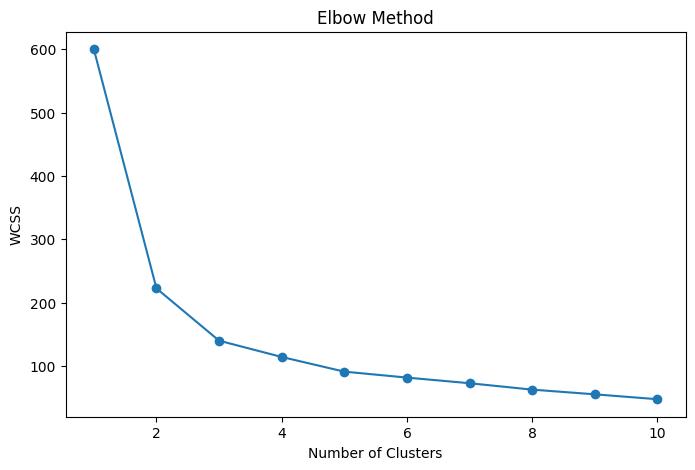
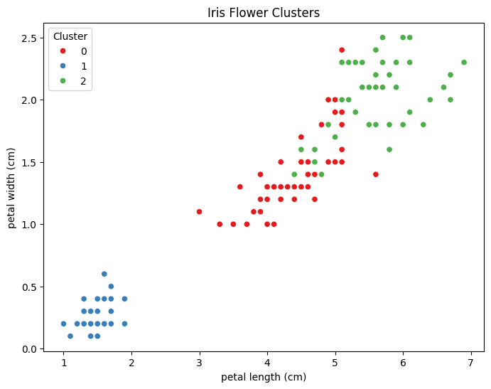

# iris-kmeans-clustering-analysis
# Iris Flower Segmentation Using K-Means Clustering

## Project Overview

This project applies K-Means Clustering to group Iris flowers based on their physical characteristics.

## Objective

- Standardize the dataset
- Determine the optimal number of clusters using the Elbow Method
- Apply K-Means Clustering
- Visualize cluster formation

## Tools Used

- Python
- Pandas
- NumPy
- Scikit-learn
- Matplotlib
- Seaborn

## Methodology

1. Data Loading
2. Data Exploration
3. Feature Scaling
4. Elbow Method
5. K-Means Clustering
6. Cluster Visualization

## Results

The Elbow Method suggested that 3 clusters best represent the dataset.

### Elbow Method

### Cluster Visualization

## Key Findings

- K-Means successfully grouped similar flowers.
- Petal measurements provided strong cluster separation.
- Three distinct clusters were identified.

- 🔗LinkedIn Update: https://www.linkedin.com/posts/glory-anaga_github-anagagloryiris-kmeans-clustering-analysis-share-7467818371741396992-i3vq/?utm_source=share&utm_medium=member_ios&rcm=ACoAAEzcjzYBKYK0E8nWmeqz2AhiJ-Qde3g72iM

## Author

Glory Anaga
